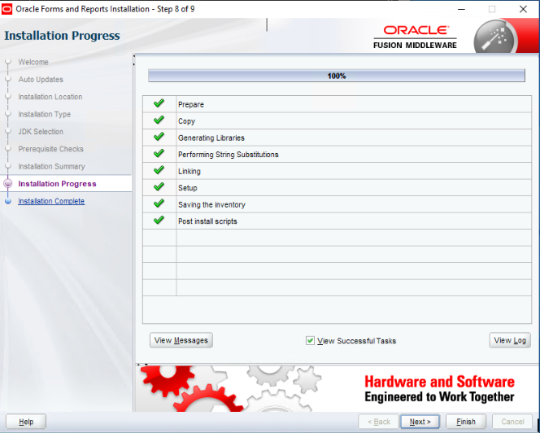

# Instalación de Oracle Forms 12c Standalone

## Requerimientos

- Java SE Development Kit
- MS Visual C++ 2012
- Oracle Forms 12c

## Consideracines

La instalación fué realizada sobre Windows 10 Pro x64

## Instalación de Java Development Kit 8

La instalación del JDK SE es la tipica, la versión utilizada se puede encontrar en el siguiente enlace:

[Java SE Development Kit](https://www.oracle.com/java/technologies/javase/javase8-archive-downloads.html)

## Instalación de MS Visual C++

Oracle Forms 12c requiere de MS Visual C++ 2012 para su instalación. Se pueden obtener desdes el siguiente enlace:

[MS Visual C++ 2012](https://www.microsoft.com/es-es/download/details.aspx?id=30679)

## Instalación de Oracle Forms 12c

Se debe de contar con el instalador de Oracle Forms 12c, sino lo tiene, puede obtenerlo en el siguiente enlace:

[Oracle Forms 12c](https://www.oracle.com/middleware/technologies/forms/downloads.html)

Doble click sobre el ejecutable "setup_fmw_12.2.1.4.0_fr_win64" para abrir el asistente de instalación gráfica y presionar el boton "Next"

Seleccionar "Skip Auto Updates" y presionar el botón "Next"

Seleccionar la ubicación del Oracle Home y presionar el botón "Next"

Seleccionar el tipo de instalación como "Standalone Forms Builder" y presionar el botón "NexT"

Seleccionar la ubicación del JDK instalado previamente y presionar el botón "Next"

Se realizaran unos chequeos de requisitos, si surge alguna alerte, solventarla y correr los chequeos nuevamente. Presionar el botón "Next" al finalizar el chequeo.

Se mostrara una pantalla con el resumen de instalación, se presentará la opción de guardar Response File, este archivo es util para realizar instalaciones desatendidas de Oracle Forms 12c. Presionar el botón "Next" para iniciar la instalación.

Si surge una alerta del firewall, permitir el acceso a la red al binario de java, aceptarlo.

Al finalizar la instalación presionar el botón "Next"

Seleccionar la casilla "Automatically Launch Forms Builder Configuration Wizard" y presionar el botón "Finish" para cerrar el programa de instalación e iniciar el proceso de configuración de Oracle Forms 12c.

En el programa de configuración, seleccionar la ubicación de la instancia y presionar el botón "Next".

En la pantalla de progreso de configuración presionar el botón "Next" una vez este finalizado.

Presionar el botón "Finish" para cerrar el asistente de configuración.

Iniciar Oracle Forms Builder desde el menú de inicio.
